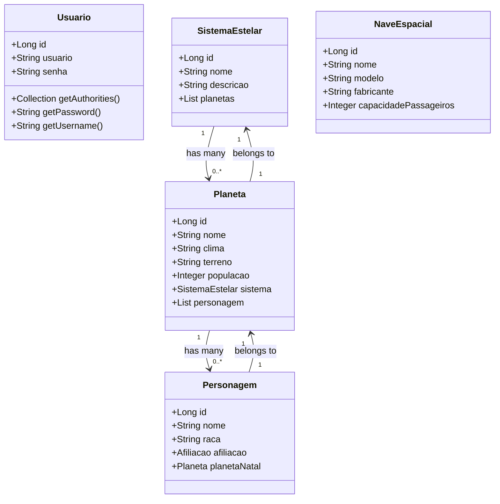

# Star Wars API

## Descrição
Criação, gerenciamento e visualização de uma galáxia inspirada em Star Wars, incluindo planetas, sistemas estelares, personagens e naves espaciais.

## Tecnologias
- Java 17
- Mysql
- Spring Boot 3
- Spring Web
- Spring Data JPA
- Hibernate
- Lombok
- Validation
- Spring Security
- JSON Web Token (JWT)
- Railway
- Junit
- OpenAPI (Swagger)

## Diagrama de Classes (Domínio da API)

## Testes
Para testar a aplicação basta acessar esta URL: https://star-wars-api-star-wars-api.up.railway.app/swagger-ui/index.html#/

## Contribuição

Contribuições são bem-vindas! Siga os passos abaixo:

1. Fork o repositório.
2. Crie uma nova branch (git checkout -b feature/nova-feature).
3. Commit suas alterações (git commit -m 'Adiciona nova feature').
4. Push para a branch (git push origin feature/nova-feature).
5. Abra um Pull Request.

